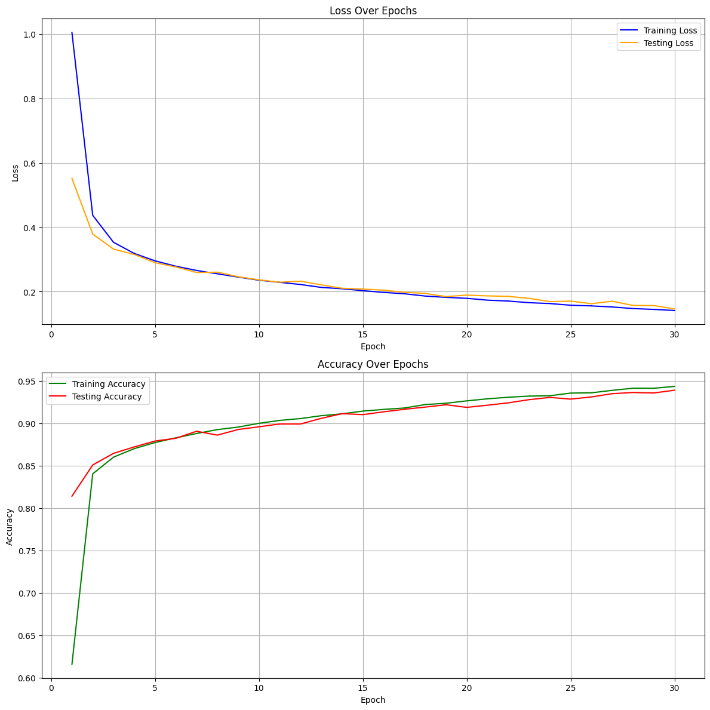
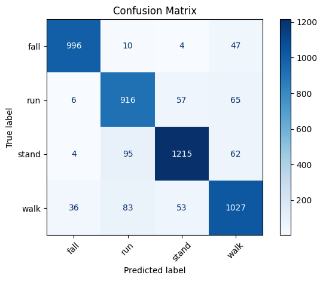

# Model Training

- [Training](./model_training.ipynb): Pytorch Framework.
- Model consists of 2 BiLSTM layers with 1 Attention Layer.
- Data is split based on a sliding window method which selects a fixed length of rows to create training data where each window slides with a fixed length of step.

### Visualization

|   |
|:--------------------------------:|

|     |
|:--------------------------------:|

## Requirements
The requirements to run this code are:
- Globe
- Matplotlib
- Numpy
- Scikit-Learn
- Torch