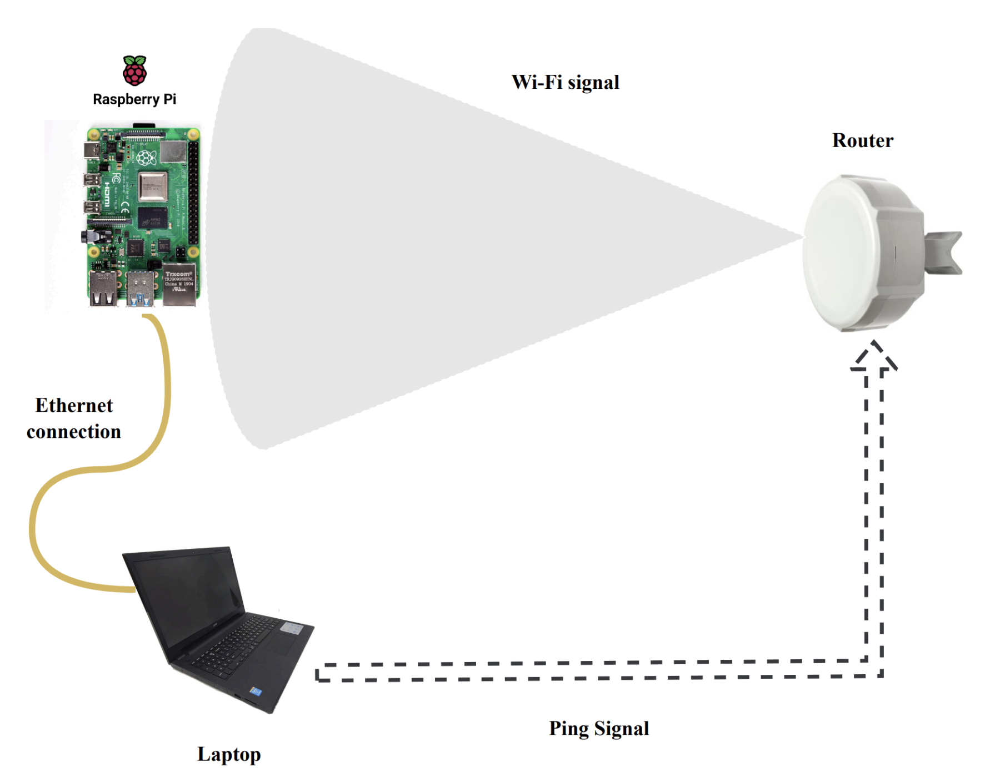

# 🎓 A Deep Learning Based Human Activity Recognition Using Wi-Fi Signals
#### Major Project :

This project uses a Raspberry Pi and Wi-Fi router to collect Channel State Information (CSI) data, which tracks changes in Wi-Fi signals caused by human movements, to train a model that recognizes different human activities.

|   |
|:---------------------------------------------:|

## Project Workflow

- **Hardware**: Integrating Hardware components for data collection.

- **Data Collection**: Collecting CSI data using Raspberry Pi(Rx) and Router(Tx).

- **Preprocessing**: Filtering and transforming the CSI data.

- **Visualization**: Visualizing the CSI data before and after preprocessing.

- **Feature Extraction and Annotation**: Extracting features from the preprocessed data and annotating the data for training.

- **Model Training**: Building model architecture and training the model to recognize different human activities.

- **UI**: Developing an application integrating all the components.

    ```mermaid
    graph TD
        A[Hardware Setup] --> B[CSI Data Collection]
        B --> C[Preprocessing]
        C --> D[Visualization]
        D --> E[Feature Extraction and Annotation]
        E --> F[Model Training]
        F --> G[UI]
    ```
---

## Repository Structure

<!-- - [Documents](./Documents/): Project Report & Presentation. -->

- [Implementation](./Implementation/): Source Code.

- [Reference Papers](./Reference%20Papers/): Researches Highly Relevant to our work.
